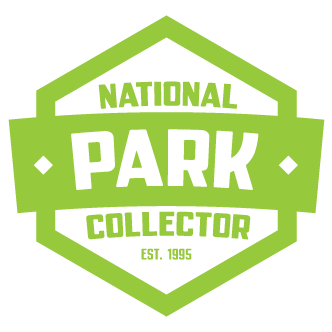
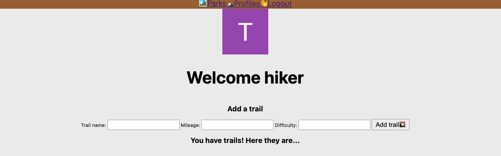
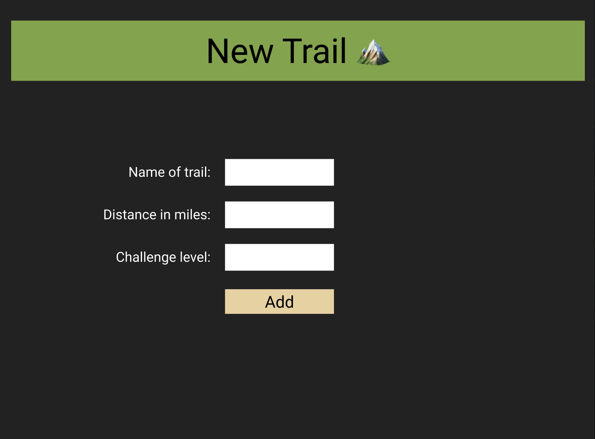

# National Parks Collector🏞
----
[National Parks Collector](https://nationalparkscollector.herokuapp.com/)

National Parks Collector enables the user to log their visits to America's natural wonders. Users may check off which trails they've hiked, the duration in miles, and the difficulty level.

# Trello Planning🏞
----
[Trello Planning](https://trello.com/b/ZsAXpnDL/national-parks-collector)

# Screenshots🏞
----

# Stretch Goals🏞
----
- Create national park badge icons to accompany each park log entry.
- Incorporate pictures of national parks.
- Make responsive to all devices and breakpoints.
- A mobile app that collects the GPS coordinates of a user to verify they are in, or have been to the park. This would include a leaderboard and competitive twist.

# Technology Used and Implemented🏞
----

